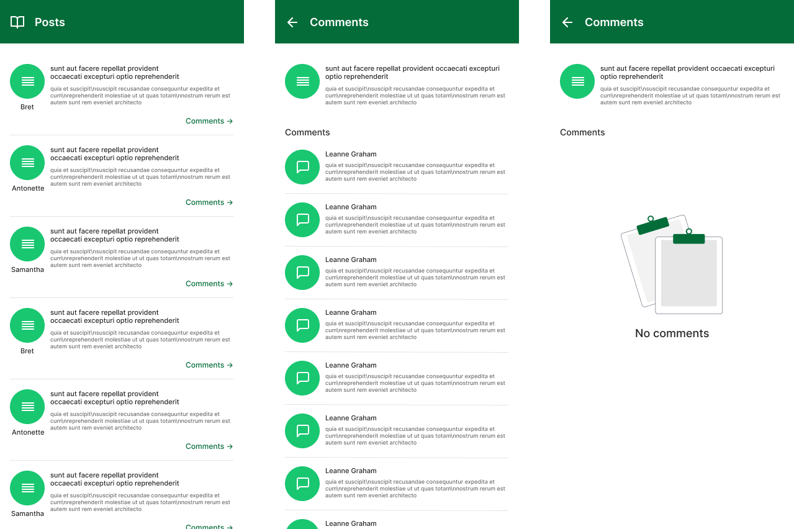

# Posts Challenge

If you want to take a look on Figma project, [its here](https://www.figma.com/file/cEFPVfI2Cq9rdZOdNo3O1K/Posts-Challenge?type=design&node-id=0%3A1&mode=design&t=oP6aZDAOdzLuHknX-1).

## Technologies Used

- Flutter
- Dart
- Bloc/Cubit
- Modular
- Dio
- API {Json} Placeholder

## Installation and Usage
To install and use the project, follow these steps:

- Make sure you have the Flutter SDK installed on your development environment.

`https://docs.flutter.dev/get-started/install`

- Clone this repository to your local environment.

`git clone https://github.com/GiovaneLopes/posts_challenge.git`

- Navigate to the project directory.

`cd posts_challenge`

- Run the command to fetch the necessary dependencies.

`flutter pub get`

- Start the application on an emulator or connected device.

`flutter run`

- Make sure the emulator or connected device has internet acess.